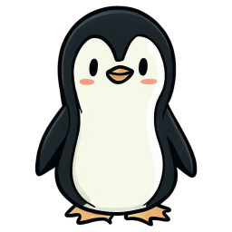

#  One-time modeling projects, just for fun

So, I got a little obsessed with machine learning. Like, really obsessed. This repo is a dumping ground for all the crazy experiments I’ve tried. From predicting the future (kind of) to building robots (okay, not really), it’s all here. Buckle up, it’s about to get nerdy!

  
  Let's waddle through our favorite penguin data with K-means clustering!  [Do penguins of the same species exhibit different physical characteristics based on sex?](https://github.com/sdsouto/standalone-models/blob/main/K-means_clustering_penguins.ipynb).

